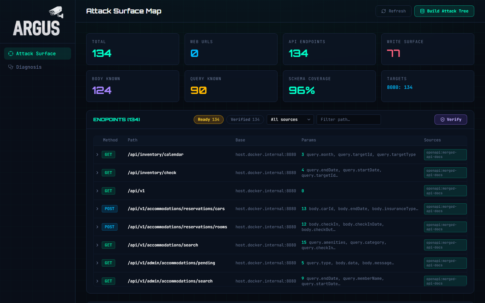
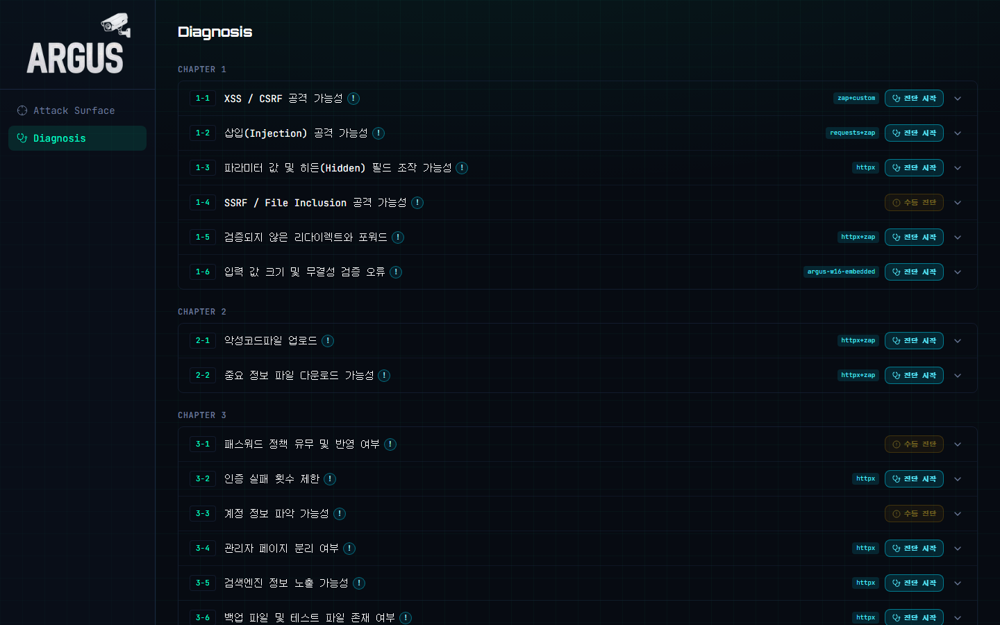
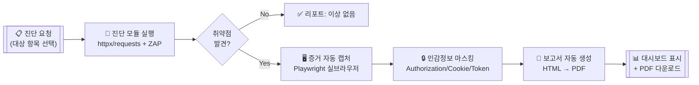
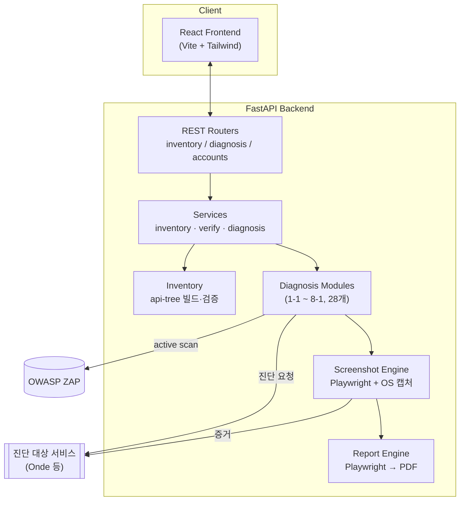
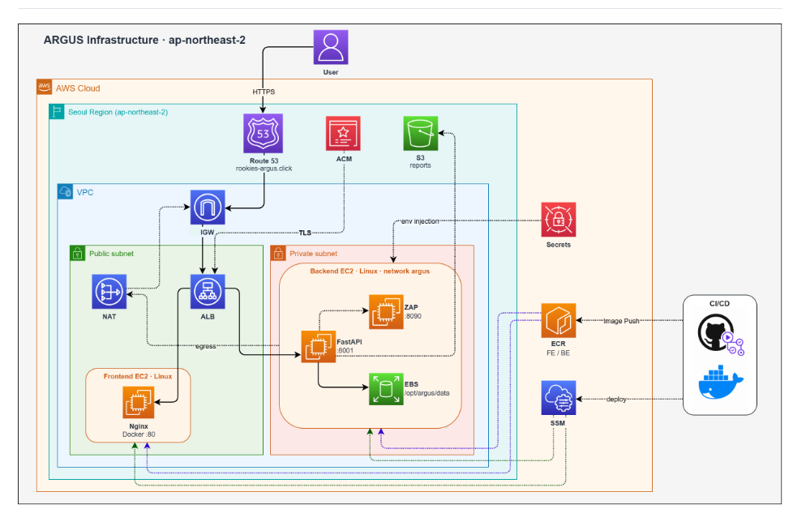

<div align="center">

# 🛡️ ARGUS

**SK쉴더스 WEB·API 개발보안 가이드 기반 웹 취약점 자동 진단 플랫폼**

8개 챕터 · 28개 진단 항목을 자동으로 점검하고, 발견된 취약점의 증거를 캡처해 보고서까지 자동 생성합니다.

[](backend/requirements.txt)
[](backend/requirements.txt)
[](frontend/package.json)
[](frontend/package.json)
[](backend/requirements.txt)
[](backend/integrations/zap)
[](docker-compose.yml)
[](#인프라-구조)

</div>

---

## 👥 팀 소개

<div align="center">

| [](https://github.com/nirey-l) | [](https://github.com/Eojinn) | [](https://github.com/Hyeonseok93) | [](https://github.com/pjcosmos) | [](https://github.com/yoojisoo99) | [](https://github.com/JangSeonguk1011) | [](https://github.com/hongjiho5148) |
|:---:|:---:|:---:|:---:|:---:|:---:|:---:|
| [이예린](https://github.com/nirey-l) | [김어진](https://github.com/Eojinn) | [김현석](https://github.com/Hyeonseok93) | [박진아](https://github.com/pjcosmos) | [유지수](https://github.com/yoojisoo99) | [장성욱](https://github.com/JangSeonguk1011) | [홍지호](https://github.com/hongjiho5148) |

SK쉴더스 루키즈 5기 팀 프로젝트

</div>

---

## 📌 개요

**ARGUS**는 여행 예약 서비스 **Onde**를 진단 대상으로 삼아 개발한 웹·API 취약점 자동 진단 플랫폼입니다.

SK쉴더스 WEB·API 개발보안 가이드의 8개 챕터 28개 체크리스트를 진단 카탈로그로 삼아, 각 항목마다 독립된 진단 모듈이 대상 서비스에 실제 요청을 보내고 응답을 분석해 취약점 여부를 자동으로 판정합니다. 취약점이 발견되면 증거 화면을 자동으로 캡처하고, 이를 바탕으로 보고서 초안까지 자동 생성해 **진단 → 증거 확보 → 보고서 작성**이 하나의 흐름으로 이어집니다.

28개 항목 중 **20개 항목**은 자동 진단 엔진이 구현되어 있고, 나머지 8개는 업무 맥락 판단이 필요하거나 서비스마다 기준이 달라 수동 진단 또는 향후 확장 대상으로 남아 있습니다.

---

## ✨ 주요 기능

| 기능 | 설명 |
|---|---|
| 🔍 **28개 항목 자동 진단** | XSS·CSRF, SQL Injection, IDOR·권한상승, SSRF, 세션·쿠키 조작 등 SK쉴더스 가이드 8개 챕터를 카탈로그로 관리하고 항목별 독립 모듈로 진단 |
| 🌐 **API 인벤토리 자동 수집** | OpenAPI/Swagger 명세 또는 URL·API 리스트를 입력받아 진단 대상 엔드포인트 트리를 빌드·검증(Verify) |
| 📸 **증거 자동 캡처** | 취약점 발견 시 실제 브라우저 창을 띄워 요청·응답 과정을 캡처. 캡처 전 Authorization/Cookie/토큰 값은 자동 마스킹 |
| 📄 **보고서 자동 생성** | 진단 결과를 집계해 심각도별 통계와 함께 PDF 보고서를 자동 생성 |
| 🔁 **다중 계정 기반 권한 진단** | 두 개의 테스트 계정을 자동으로 오가며 수직·수평 권한상승, IDOR을 재현 |
| 🐳 **OWASP ZAP 연동** | 액티브 스캔이 필요한 항목은 ZAP과 직접 연동해 취약점 스캔 수행 |

---

## 🖥️ 화면

| Attack Surface Map | Diagnosis |
|---|---|
|  |  |
| Build/Verify로 수집한 API 인벤토리 대시보드 | 8챕터 28항목 진단 카탈로그 — 항목별 엔진 표시 |

---

## 🛠️ 기술 스택

| 구분 | 기술 | 용도 |
|---|---|---|
| **Backend** | `Python 3.12` · `FastAPI` · `Uvicorn` | REST API 서버, 진단 모듈 실행 |
| | `httpx` · `requests` | 진단 요청 전송, 응답 비교 분석 |
| | `OWASP ZAP` | 액티브 스캔 연동 |
| | `Playwright` | 증거 화면 캡처, HTML → PDF 변환 |
| | `ReportLab` · `pypdf` | PDF 보고서 생성·처리 |
| **Frontend** | `React 19` · `TypeScript` · `Vite` | 진단 대시보드 UI |
| | `Tailwind CSS` · `lucide-react` | 스타일링, 아이콘 |
| | `Nginx` | 정적 파일 서빙 (프로덕션 컨테이너) |
| **Infra** | `AWS` — EC2 · ALB · Route53 · ACM | 서비스 호스팅, HTTPS 라우팅 |
| | `AWS` — S3 · ECR · Secrets Manager · SSM | 리포트 저장, 이미지 레지스트리, 시크릿 주입, 원격 배포 |
| | `Terraform` | 인프라 코드화 (IaC) |
| **DevOps** | `Docker` · `Docker Compose` | 컨테이너 기반 실행·배포 |
| | `GitHub Actions` | OIDC 기반 CI/CD |

---

## 🔄 진단 파이프라인



---

## 🏗️ 아키텍처 구조



- **모듈형 모놀리스**: 진단 모듈은 `DiagnosisModule` 공통 인터페이스(`run(ctx) → SectionReport`)를 구현하는 플러그인 구조이며, `catalog.py` + `registry.py`가 28개 모듈을 로드합니다.
- **엔진 다양화**: 항목별로 `httpx`(패시브 프로브), `requests`(권한상승 등 직접 호출), `httpx+zap`(액티브 스캔 병행) 중 적합한 방식을 선택합니다.

---

## ☁️ 인프라 구조

<div align="center">
  
</div>

- **리전**: `ap-northeast-2` (서울)
- **네트워크**: Route53 → ALB(HTTPS/ACM) → Public Subnet(Frontend Nginx) / Private Subnet(Backend FastAPI + ZAP)
- **배포**: GitHub Actions → OIDC로 AWS 임시 자격 증명 발급 → ECR 이미지 push → `repository_dispatch`로 배포 트리거 → SSM 기반 배포
- **데이터**: 진단 산출물은 Backend EC2 EBS 볼륨에, 리포트는 S3에 저장
- **보안**: Secrets Manager로 민감 설정값 주입, 인바운드는 ALB → Frontend → Backend 최소 권한 3계층 보안그룹으로 제한

---

## 🚀 실행 방법

### 요구 사항
- Docker / Docker Compose

### 로컬 실행

```bash
git clone https://github.com/hongjiho5148/ARGUS_Merge.git
cd ARGUS_Merge
docker compose up -d --build
```

| 서비스 | 접속 주소 |
|---|---|
| Frontend (Dashboard) | http://localhost:5174 |
| Backend API / Swagger | http://localhost:8001/docs |
| OWASP ZAP | http://localhost:8090 |

### 진단 실행 순서

1. **Dashboard → Build** : Swagger/OpenAPI 또는 URL·API 리스트 업로드 → api-tree 생성
2. **Base URLs / Test Accounts / Login** : 진단 대상 base URL과 테스트 계정 등록
3. **Verify** : 등록한 엔드포인트 검증 (`api-tree-verified.json` 생성)
4. **Diagnosis** : 챕터별 진단 항목 선택 후 **진단 시작** → 결과·증거·보고서 확인

---

## 📂 프로젝트 구조

```
ARGUS_Merge/
├── backend/                  FastAPI 서버
│   ├── app/                  라우터·서비스 (HTTP API 레이어)
│   ├── inventory/            api-tree 생성·병합·검증
│   ├── diagnosis/             28개 진단 모듈 (modules/1-1 ~ 8-1)
│   ├── screenshot/            증거 캡처 엔진 (Playwright)
│   ├── report/                 PDF 보고서 생성 엔진
│   └── integrations/zap/       OWASP ZAP API 클라이언트
├── frontend/                  React 대시보드
├── .github/assets/                README용 다이어그램·이미지
└── docker-compose.yml          backend + frontend + ZAP
```

---

## 📋 진단 항목 현황 (8 챕터 · 28항목 · 20개 자동화)

<details>
<summary>전체 항목 펼치기</summary>

| 챕터 | 항목 | 상태 |
|---|---|:---:|
| 1. 입력 데이터 검증 | 1-1 XSS/CSRF | ✅ |
| | 1-2 삽입(Injection) | ✅ |
| | 1-3 파라미터·Hidden 필드 조작 | ✅ |
| | 1-4 SSRF/File Inclusion | ⏳ |
| | 1-5 미검증 리다이렉트 | ✅ |
| | 1-6 입력 값 크기·무결성 | ✅ |
| 2. 파일 업·다운로드 | 2-1 악성코드파일 업로드 | ✅ |
| | 2-2 중요 정보 파일 다운로드 | ✅ |
| 3. 인증·접근통제 | 3-1 패스워드 정책 | ⏳ |
| | 3-2 인증 실패 횟수 제한 | ✅ |
| | 3-3 계정 정보 파악 | ⏳ |
| | 3-4 관리자 페이지 분리 | ✅ |
| | 3-5 검색엔진 정보 노출 | ✅ |
| | 3-6 백업·테스트 파일 | ✅ |
| 4. 세션·접근제어 | 4-1 쿠키·Web Storage 조작 | ⏳ |
| | 4-2 세션·토큰 안전성 | ⏳ |
| | 4-3 접근제어 우회 | ⏳ |
| | 4-4 비인증 중요 페이지 접근 | ✅ |
| | 4-5 일반계정 권한 상승(IDOR) | ✅ |
| 5. 데이터 보호 | 5-1 소스코드 내 정보 노출 | ⏳ |
| | 5-2 요청·응답 값 정보 노출 | ✅ |
| 6. 오류 처리 | 6-1 오류페이지 정보 노출 | ✅ |
| | 6-2 일괄 오류 처리 페이지 | ✅ |
| 7. 서버 보안 | 7-1 Client Request Method | ✅ |
| | 7-2 파일 목록화 | ✅ |
| | 7-3 서버 헤더정보 노출 | ✅ |
| | 7-4 취약한 보안설정 | ✅ |
| 8. 기타 | 8-1 미분류 취약점 | ⏳ |

✅ 자동 진단 구현 · ⏳ 수동 진단/향후 확장

</details>
